<div align="center">
    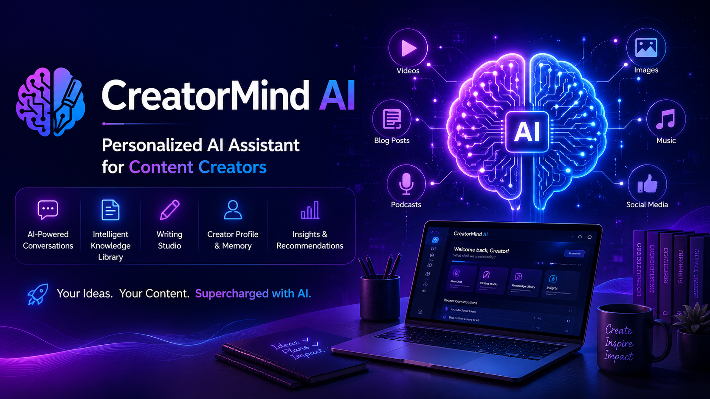
  
  <br />
  <br />

  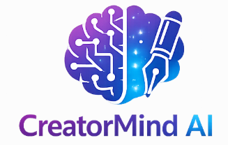

  <h1 align="center">CreatorMind AI</h1>

  <p align="center">
    <strong>A next-generation AI content engine that clones, retains, and scales a creator's unique voice using IBM Watsonx and RAG.</strong>
    <br />
    <br />
    <a href="https://github.com/gowthamvanjimuthu-cyber/CreatorMind-AI/issues">Bug Report</a>
    ·
    <a href="https://github.com/gowthamvanjimuthu-cyber/CreatorMind-AI/issues">Feature Request</a>
    ·
    <a href="#demo">View Demo</a>
  </p>

  <p align="center">
   <a href="https://www.python.org/">
  
</a>
   <a href="https://fastapi.tiangolo.com/">
  
</a>

<a href="https://react.dev/">
  
</a>

<a href="https://www.typescriptlang.org/">
  
</a>

<a href="https://www.ibm.com/watsonx">
  
</a>

<a href="https://www.trychroma.com/">
  
</a>

<a href="https://supabase.com/">
  
</a>

<a href="https://www.docker.com/">
  
</a>
    <a href="LICENSE"></a>
  </p>
</div>

---

## 📑 Table of Contents

- [Project Overview](#project-overview)
- [Problem Statement](#problem-statement)
- [Solution](#solution)
- [Key Features](#key-features)
- [Technology Stack](#technology-stack)
- [Architecture Overview](#architecture-overview)
- [Folder Structure](#folder-structure)
- [Installation](#installation)
- [Running Locally](#running-locally)
- [Environment Variables](#environment-variables)
- [Screenshots & Demo](#screenshots--demo)
- [IBM Granite Integration](#ibm-granite-integration)
- [RAG Pipeline](#rag-pipeline)
- [Creator Profile](#creator-profile)
- [Deployment](#deployment)
- [Future Roadmap](#future-roadmap)
- [Developer](#developer)
- [Contributing](#contributing)
- [License & Acknowledgements](#license--acknowledgements)

---
<a id="project-overview"></a>

## 🌍 Project Overview

CreatorMind AI is an AI-powered content creation platform built for the IBM AI Builders Challenge. It combines Retrieval-Augmented Generation (RAG), ChromaDB, and IBM watsonx Granite models to help creators generate personalized content while preserving their unique writing style and knowledge base.

The platform allows users to upload documents, build a creator profile, retrieve relevant knowledge through semantic search, and generate context-aware content using AI.


<a id="problem-statement"></a>

## ⚠️ Problem Statement
Scaling content creation inevitably dilutes an author's authentic voice. Relying on generic LLM prompts results in flat, impersonal writing lacking the nuanced formatting, reading level, and unique rhythm of the original creator.

<a id="solution"></a>

## 💡 Solution

CreatorMind AI combines document ingestion, semantic search, creator profiling, and AI-powered content generation into a unified platform.

Uploaded documents are processed through a RAG pipeline, stored in ChromaDB, and retrieved whenever relevant. A creator profile captures writing style, tone, and preferences so generated content better reflects the creator's unique voice.

<a id="key-features"></a>

## 🚀 Key Features
- **Deterministic Style Extraction:** Asynchronous extraction of tone, pacing, and vocabulary metrics.
- **Multi-Tenant Security Isolation:** Cryptographic barrier protecting RAG chunks across multiple Workspaces.
- **RAG Second Brain:** ChromaDB powered intelligence ingesting PDFs and DOCX files.
- **FastAPI SSE Streaming:** Extremely low-latency Server-Sent Events typing directly into the React UI.
- **Granular Dashboard Analytics:** Real-time generation tracing, average inference latency, and vector load times.

## ✨ Feature Showcase

| Feature | Description |
|---------|-------------|
| 📚 Knowledge Library | Upload PDFs, DOCX, and TXT files for AI knowledge retrieval. |
| 💬 AI Workspace | Chat with IBM Granite using Retrieval-Augmented Generation (RAG). |
| ✍️ Writing Studio | Generate blogs, LinkedIn posts, tweets, newsletters, and more. |
| 👤 Creator Profile | Learns writing style, tone, and audience from uploaded content. |
| 📊 Analytics Dashboard | Track content generation and workspace activity. |
| 📅 Calendar | Plan and organize publishing schedules. |
| ⚙️ Settings | Manage account preferences and application configuration. |


<a id="technology-stack"></a>

## 🛠️ Technology Stack
| Layer | Technologies |
|-------|--------------|
| Frontend | React, Vite, TypeScript, Tailwind CSS |
| Backend | FastAPI, Python, Pydantic |
| Database | SQLite |
| Vector Database | ChromaDB |
| Authentication | Supabase |
| AI Models | IBM watsonx Granite / Mock Provider |
| Deployment | Docker |

<a id="architecture-overview"></a>

## 📐 Architecture Overview

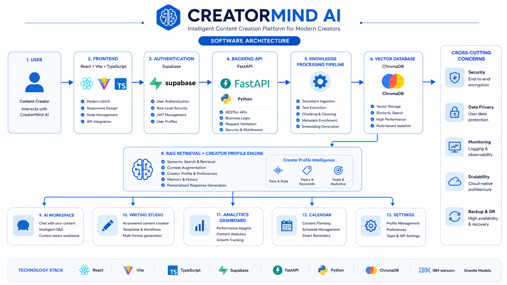

1. **Frontend:** Dispatches requests spanning multiple workspace UUIDs. 
2. **Knowledge Service:** Receives `.pdf` uploads, executing `RecursiveCharacterTextSplitter`.
3. **ChromaDB:** Ingests chunks attached with tight metadata clauses (strict `$and` tenant bounds).
4. **Style Analyzer:** Extracts a subset of chunks, passes to **IBM Granite**, and returns structured JSON Persona Traits.
5. **Prompt Composer:** Synthesizes the RAG context against the Persona Traits bounding Granite to strict outputs.

<a id="folder-structure"></a>

## 📁 Folder Structure
```text
CreatorMind/
├── backend/          # Python 3.10 FastAPI / SQLite / ChromaDB
├── frontend/         # React / TypeScript / Vite / Tailwind
├── docs/             # Extensive Architectural Documentation
└── .github/          # CI/CD, Issue Templates
```

<a id="installation"></a>

## ⚙️ Installation

### Prerequisites

- Node.js 18+
- Python 3.10+
- SQLite3

1. Clone the repository:

```bash
git clone https://github.com/gowthamvanjimuthu-cyber/CreatorMind-AI.git
```
2. Configure the `.env` file inside the `backend` directory (see below).

---

<a id="running-locally"></a>

## 🏃 Running Locally
### Backend

```bash
cd backend
python -m venv venv

# Windows
venv\Scripts\activate

# macOS/Linux
source venv/bin/activate

pip install -r requirements.txt
py -m uvicorn app.main:app --reload
```

### Frontend
```bash
cd frontend
npm install
npm run dev
```

<a id="environment-variables"></a>

## 🔐 Environment Variables

Create a `.env` file inside the `backend` directory and add:

```env
CHROMA_DB_DIR=./chroma_data
```

> **Note:** Local development uses the built-in mock AI provider. IBM watsonx Granite can be enabled later by supplying valid IBM credentials.

<a id="screenshots--demo"></a>

## 📷 Screenshots & Demo
### 🔐 Login

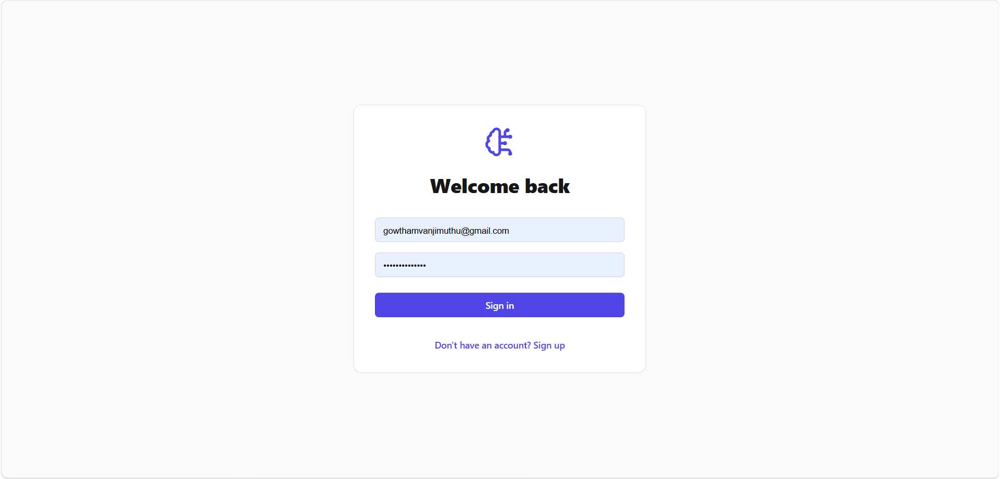

---

### 📊 Dashboard

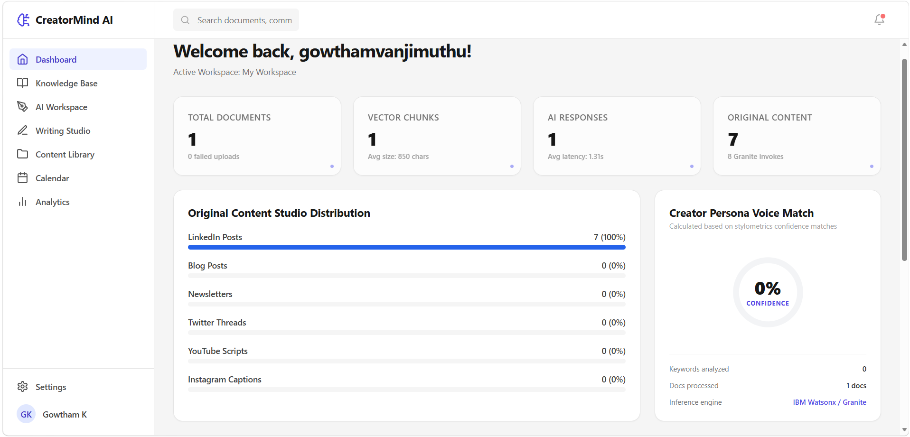

---

### 📚 Knowledge Library

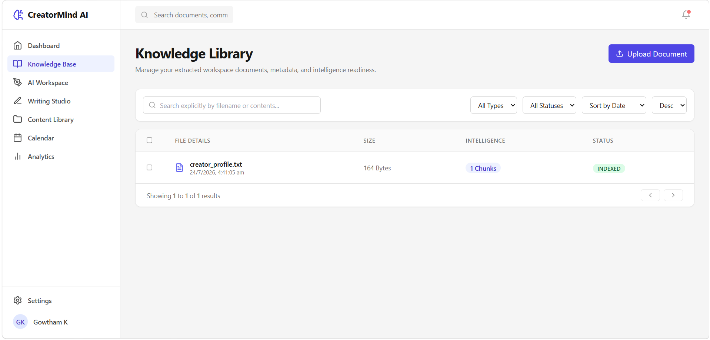

---

### 💬 AI Workspace

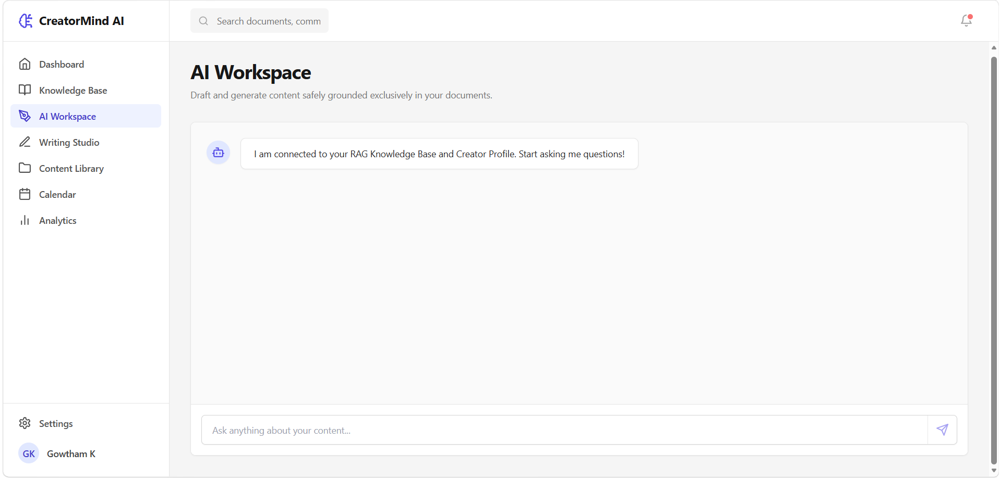

---

### ✍️ Writing Studio

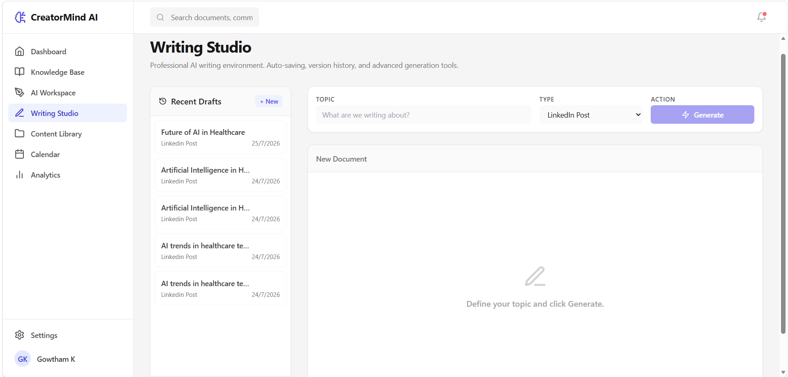

---

### 📈 Analytics

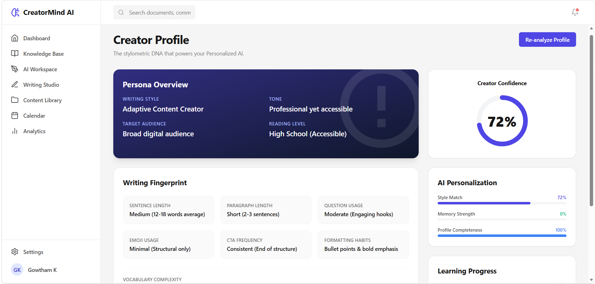

---

### 📅 Calendar

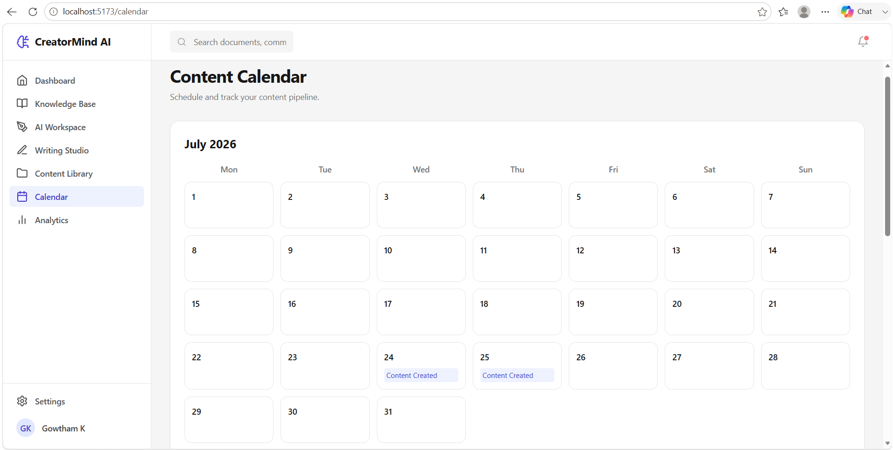

---

### 👤 Profile


---

### ⚙️ Settings

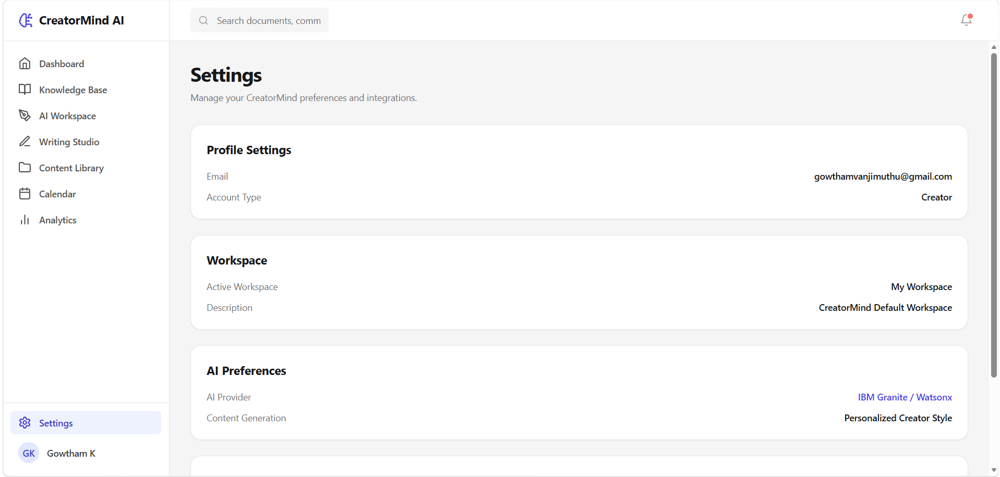

---

<a id="demo"></a>

### 🎥 Demo Video

Watch the complete walkthrough here:

**YouTube:** https://youtu.be/your-video-link

### 🎬 Demo GIF


<a id="ibm-granite-integration"></a>

## 🧠 IBM Granite Integration

CreatorMind AI is designed to integrate with IBM watsonx Granite models for enterprise-grade AI content generation.

During local development, the application supports a mock AI provider, allowing the platform, RAG pipeline, and user interface to be tested without requiring IBM watsonx API credentials.

When IBM watsonx credentials are available, the application can be configured to use IBM Granite models without changes to the frontend.

<a id="rag-pipeline"></a>

## 📚 RAG Pipeline

The Retrieval-Augmented Generation (RAG) pipeline follows these steps:

1. Upload documents (PDF, DOCX, TXT)
2. Parse and split documents into chunks
3. Generate embeddings
4. Store vectors in ChromaDB
5. Retrieve relevant context
6. Combine creator profile with retrieved knowledge
7. Generate responses using IBM Granite (or the mock provider during local development)

<a id="creator-profile"></a>

## 👤 Creator Profile


CreatorMind AI analyzes uploaded creator content to build a personalized AI persona by extracting:

- Writing style
- Tone
- Target audience
- Reading level
- Sentence structure
- Formatting habits
- Vocabulary complexity

These insights are injected into every AI generation, ensuring content closely matches the creator's unique voice and style.

<a id="deployment"></a>

## 🚢 Deployment

The application is container-ready and can be deployed using Docker.

Future deployment targets include:

- IBM Cloud
- Render
- Railway
- Azure App Service

<a id="future-roadmap"></a>

## 🔮 Future Roadmap

- IBM watsonx production integration
- Multi-user workspaces
- Voice profile improvements
- Content scheduling
- Cloud deployment
- Mobile responsive interface
- Advanced analytics dashboard

<a id="developer"></a>


## 👨‍💻 Developer

**Gowtham Vanjimuthu**  
AI & Data Science Student

Creator and developer of **CreatorMind AI**.

<a id="contributing"></a>

## 🤝 Contributing

Contributions, suggestions, and feedback are welcome!

Please read the [CONTRIBUTING.md](CONTRIBUTING.md) guide before submitting a pull request, and follow our [CODE OF_CONDUCT.md](CODE_OF_CONDUCT.md) to help maintain a welcoming community.

<a id="license--acknowledgements"></a>

## 📜 License & Acknowledgements
Built under the **MIT License**.
A massive thank you to the **IBM AI Builders Challenge** for providing the Granite endpoints and enterprise scale inspiration!

---

<div align="center">

Made with ❤️ using **React**, **FastAPI**, **ChromaDB**, and **IBM watsonx Granite**

⭐ If you found this project interesting, consider giving it a star!

</div>
