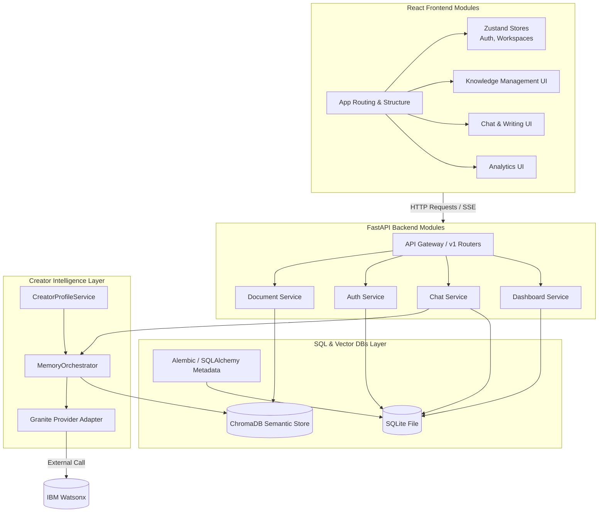

# Component Diagram

```mermaid
graph TD
    %% Base React Layer
    subgraph Frontend [React Frontend Modules]
        AppUI[App Routing & Structure]
        Zustand[Zustand Stores\nAuth, Workspaces]
        KnowledgeUI[Knowledge Management UI]
        WorkspaceUI[Chat & Writing UI]
        DashboardUI[Analytics UI]
        AppUI --> Zustand
        AppUI --> KnowledgeUI
        AppUI --> WorkspaceUI
        AppUI --> DashboardUI
    end

    %% Base Python API Layer
    subgraph Backend [FastAPI Backend Modules]
        MainRouter[API Gateway / v1 Routers]
        DocumentSvc[Document Service]
        AuthSvc[Auth Service]
        ChatSvc[Chat Service]
        DashboardSvc[Dashboard Service]
        
        MainRouter --> DocumentSvc
        MainRouter --> AuthSvc
        MainRouter --> ChatSvc
        MainRouter --> DashboardSvc
    end

    %% Database Abstraction Layer
    subgraph DatabaseLayer [SQL & Vector DBs Layer]
        SQLite[(SQLite File)]
        Alembic[Alembic / SQLAlchemy Metadata]
        ChromaStore[(ChromaDB Semantic Store)]
        
        Alembic --> SQLite
    end

    %% Intelligence Layer
    subgraph AILayer [Creator Intelligence Layer]
        ProfileSvc[CreatorProfileService]
        Orchestrator[MemoryOrchestrator]
        GraniteAdapt[Granite Provider Adapter]
        
        ProfileSvc --> Orchestrator
        Orchestrator --> GraniteAdapt
    end

    %% Connections
    Frontend -->|HTTP Requests / SSE| Backend
    DocumentSvc --> ChromaStore
    AuthSvc --> SQLite
    ChatSvc --> Orchestrator
    DashboardSvc --> SQLite
    ChatSvc --> SQLite
    Orchestrator --> ChromaStore
    GraniteAdapt -->|External Call| IBMWatson[(IBM Watsonx)]
```
