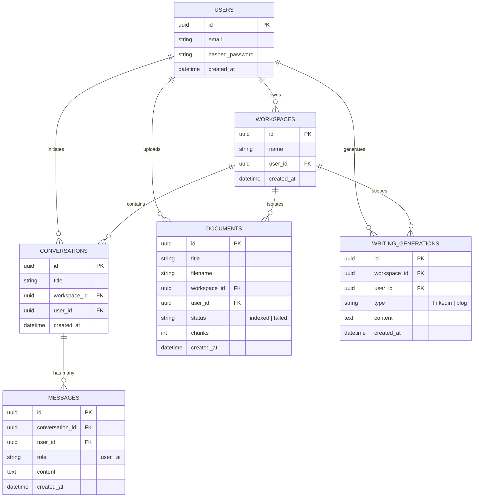

# Database Entity-Relationship Diagram

```mermaid
erDiagram
    USERS {
        uuid id PK
        string email
        string hashed_password
        datetime created_at
    }
    
    WORKSPACES {
        uuid id PK
        string name
        uuid user_id FK
        datetime created_at
    }

    CONVERSATIONS {
        uuid id PK
        string title
        uuid workspace_id FK
        uuid user_id FK
        datetime created_at
    }

    MESSAGES {
        uuid id PK
        uuid conversation_id FK
        uuid user_id FK
        string role "user | ai"
        text content
        datetime created_at
    }

    DOCUMENTS {
        uuid id PK
        string title
        string filename
        uuid workspace_id FK
        uuid user_id FK
        string status "indexed | failed"
        int chunks
        datetime created_at
    }

    WRITING_GENERATIONS {
        uuid id PK
        uuid workspace_id FK
        uuid user_id FK
        string type "linkedin | blog"
        text content
        datetime created_at
    }

    USERS ||--o{ WORKSPACES : "owns"
    USERS ||--o{ CONVERSATIONS : "initiates"
    USERS ||--o{ DOCUMENTS : "uploads"
    USERS ||--o{ WRITING_GENERATIONS : "generates"
    
    WORKSPACES ||--o{ CONVERSATIONS : "contains"
    WORKSPACES ||--o{ DOCUMENTS : "isolates"
    WORKSPACES ||--o{ WRITING_GENERATIONS : "scopes"

    CONVERSATIONS ||--o{ MESSAGES : "has many"
```
*Note: SQLite enforces foreign keys actively at runtime via `PRAGMA foreign_keys = ON`, utilizing `ON DELETE CASCADE` down the entire relational tree.*
