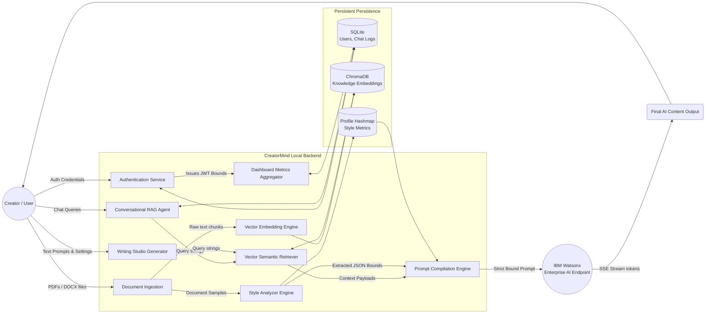

# Data Flow Diagram (DFD)

```mermaid
graph LR
    %% External Entities
    User((Creator / User))
    Watsonx((IBM Watsonx\nEnterprise AI Endpoint))

    %% User Input Flows
    User -->|Auth Credentials| AuthService
    User -->|PDFs / DOCX files| KnowledgeService
    User -->|Text Prompts & Settings| WritingService
    User -->|Chat Queries| ChatService

    %% Core Services (Backend)
    subgraph Data Flow Boundary [CreatorMind Local Backend]
        AuthService[Authentication Service]
        KnowledgeService[Document Ingestion]
        WritingService[Writing Studio Generator]
        ChatService[Conversational RAG Agent]
        StyleAnalyzer[Style Analyzer Engine]
        PromptComposer[Prompt Compilation Engine]
        
        AuthService -->|Issues JWT Bounds| DashboardSvc[Dashboard Metrics Aggregator]
        
        KnowledgeService -->|Raw text chunks| Embedder[Vector Embedding Engine]
        KnowledgeService -->|Document Samples| StyleAnalyzer
        
        ChatService -->|Query strings| Retriever[Vector Semantic Retriever]
        WritingService -->|Query strings| Retriever
        
        Retriever -->|Context Payloads| PromptComposer
        StyleAnalyzer -->|Extracted JSON Bounds| PromptComposer
    end

    %% Internal Data Stores
    subgraph Storage [Persistent Persistence]
        RelationalDB[(SQLite\nUsers, Chat Logs)]
        VectorDB[(ChromaDB\nKnowledge Embeddings)]
        ProfileHashmap[(Profile Hashmap\nStyle Metrics)]
    end

    %% Store Bindings
    Embedder --> VectorDB
    Retriever <--> VectorDB
    AuthService <--> RelationalDB
    ChatService <--> RelationalDB
    DashboardSvc <--> RelationalDB
    StyleAnalyzer --> ProfileHashmap
    ProfileHashmap --> PromptComposer

    %% Eternal Output Flow
    PromptComposer -->|Strict Bound Prompt| Watsonx
    Watsonx -->|SSE Stream tokens| GenerativeOutput(Final AI Content Output)
    GenerativeOutput --> User
```
