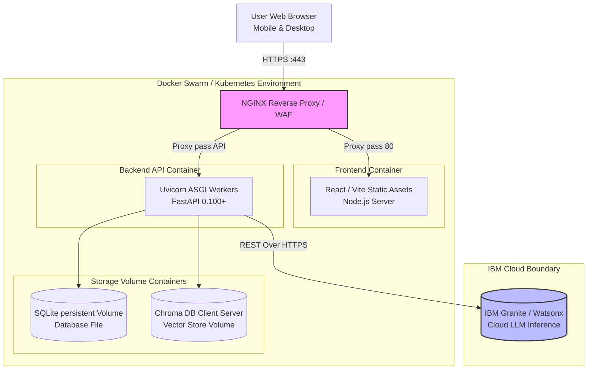

# Deployment Architecture Diagram

```mermaid
graph TD
    %% Internet Boundary
    Browser[User Web Browser\nMobile & Desktop] -->|HTTPS :443| Nginx[NGINX Reverse Proxy / WAF]

    %% Container Boundary
    subgraph Docker Swarm / Kubernetes Environment
        Nginx -->|Proxy pass 80| ReactApp
        Nginx -->|Proxy pass API| FastAPI
        
        subgraph Frontend Container
            ReactApp[React / Vite Static Assets\nNode.js Server]
        end

        subgraph Backend API Container
            FastAPI[Uvicorn ASGI Workers\nFastAPI 0.100+]
        end

        subgraph Storage Volume Containers
            SQLite[(SQLite persistent Volume\nDatabase File)]
            ChromaDB[(Chroma DB Client Server\nVector Store Volume)]
        end
        
        FastAPI --> SQLite
        FastAPI --> ChromaDB
    end

    %% External SaaS
    subgraph Remote Abstractions [IBM Cloud Boundary]
        FastAPI -->|REST Over HTTPS| IBMGranite[(IBM Granite / Watsonx\nCloud LLM Inference)]
    end
    
    style Nginx fill:#f9f,stroke:#333,stroke-width:2px
    style IBMGranite fill:#bbf,stroke:#333,stroke-width:2px
```
