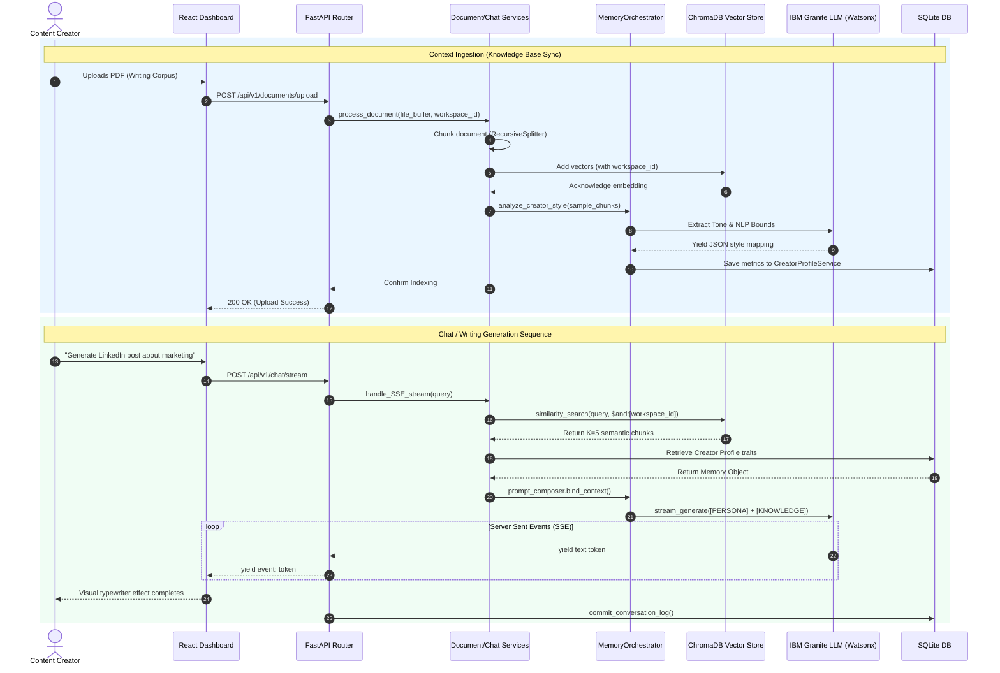

# Document RAG & Generation Sequence

```mermaid
sequenceDiagram
    autonumber
    
    actor User as Content Creator
    participant UI as React Dashboard
    participant API as FastAPI Router
    participant Service as Document/Chat Services
    participant AI as MemoryOrchestrator
    participant Chroma as ChromaDB Vector Store
    participant Granite as IBM Granite LLM (Watsonx)
    participant DB as SQLite DB

    %% Upload Document Sequence
    rect rgb(234, 246, 255)
    Note over User, DB: Context Ingestion (Knowledge Base Sync)
    User->>UI: Uploads PDF (Writing Corpus)
    UI->>API: POST /api/v1/documents/upload
    API->>Service: process_document(file_buffer, workspace_id)
    Service->>Service: Chunk document (RecursiveSplitter)
    Service->>Chroma: Add vectors (with workspace_id)
    Chroma-->>Service: Acknowledge embedding
    Service->>AI: analyze_creator_style(sample_chunks)
    AI->>Granite: Extract Tone & NLP Bounds
    Granite-->>AI: Yield JSON style mapping
    AI->>DB: Save metrics to CreatorProfileService
    Service-->>API: Confirm Indexing
    API-->>UI: 200 OK (Upload Success)
    end

    %% RAG Retrieval Sequence
    rect rgb(240, 253, 244)
    Note over User, DB: Chat / Writing Generation Sequence
    User->>UI: "Generate LinkedIn post about marketing"
    UI->>API: POST /api/v1/chat/stream
    API->>Service: handle_SSE_stream(query)
    Service->>Chroma: similarity_search(query, $and:[workspace_id])
    Chroma-->>Service: Return K=5 semantic chunks
    Service->>DB: Retrieve Creator Profile traits
    DB-->>Service: Return Memory Object
    
    Service->>AI: prompt_composer.bind_context()
    AI->>Granite: stream_generate([PERSONA] + [KNOWLEDGE])
    
    loop Server Sent Events (SSE)
        Granite-->>API: yield text token
        API-->>UI: yield event: token
    end
    
    UI-->>User: Visual typewriter effect completes
    API->>DB: commit_conversation_log()
    end
```
