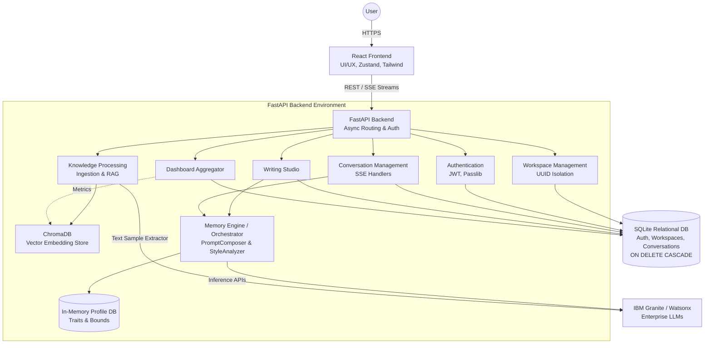

# System Architecture Diagram

```mermaid
graph TD
    %% Main Client and Entry Points
    User((User)) -->|HTTPS| ReactApp[React Frontend\nUI/UX, Zustand, Tailwind]
    
    %% API Layer
    ReactApp -->|REST / SSE Streams| FastAPI[FastAPI Backend\nAsync Routing & Auth]
    
    %% Backend Modules
    subgraph FastAPI Backend Environment
        FastAPI --> Auth[Authentication\nJWT, Passlib]
        FastAPI --> Workspace[Workspace Management\nUUID Isolation]
        FastAPI --> Chat[Conversation Management\nSSE Handlers]
        FastAPI --> Knowledge[Knowledge Processing\nIngestion & RAG]
        FastAPI --> Writing[Writing Studio]
        FastAPI --> DashboardM[Dashboard Aggregator]
        
        %% Internal Services
        Knowledge --> Chroma[ChromaDB\nVector Embedding Store]
        Writing --> Orchestrator
        Chat --> Orchestrator
        
        Orchestrator[Memory Engine / Orchestrator\nPromptComposer & StyleAnalyzer]
        Orchestrator --> ProfileDB[(In-Memory Profile DB\nTraits & Bounds)]
    end

    %% Database
    Workspace --> SQLite[(SQLite Relational DB\nAuth, Workspaces, Conversations\nON DELETE CASCADE)]
    Auth --> SQLite
    Chat --> SQLite
    Writing --> SQLite
    DashboardM --> SQLite
    DashboardM -.->|Metrics| Chroma
    
    %% External Integrations
    Orchestrator -->|Inference APIs| IBM[IBM Granite / Watsonx\nEnterprise LLMs]
    Knowledge -->|Text Sample Extractor| IBM
```
